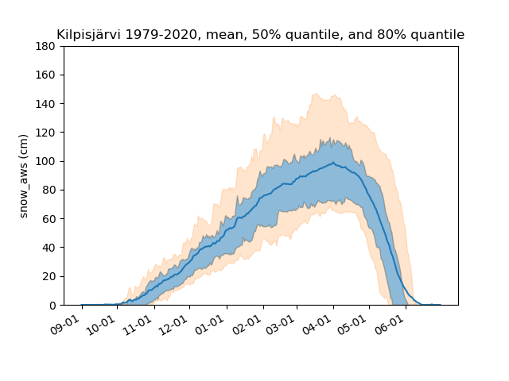

# snow-conditions
Fetch and plot historical snow conditions of FMI-sites close to ski centers in Lapland
Use FMI open data API

Project phases
1) Jupyter scripts to test the FMI-API interface - DONE
2) Python scripts to fetch, parse to pandas, create key statistics and plots - DONE
3) Visualize historical change to longest tracked key sites, test and apply ML-models - IN PROGRESS
